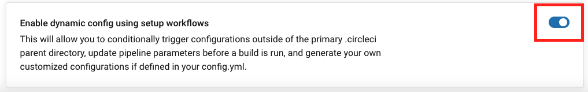
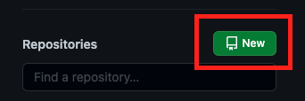
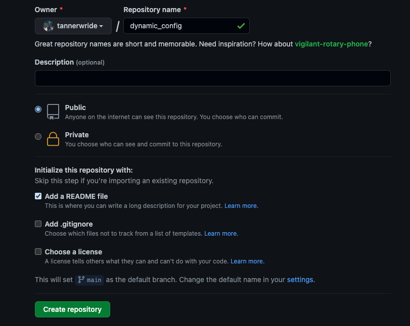
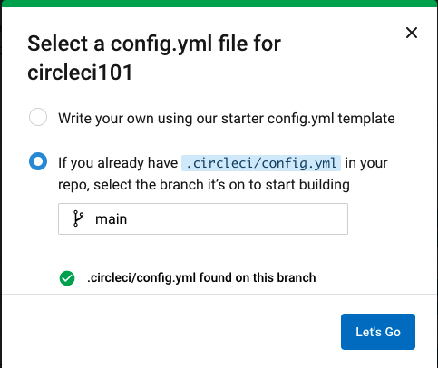
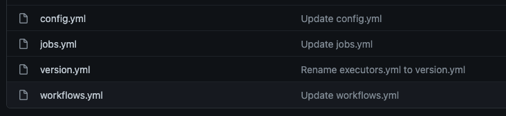

# Dynamic Config Example

In this example, we will create a basic dynamic configuration in CircleCI that merges 3 different config files into one config file. 

## Prereqs

- Some basic knowledge of YAML and CircleCI configuration
- Some basic knowledge of git and an existing GitHub.com account

## What is Dynamic Config? 

The ability to generate configurations dynamically depending on specific pipeline parameters. Dynamic config allows you to:

- Execute conditional workflows/commands
- Pass pipeline parameter values and/or generate additional configuration
- Trigger separate config.yml configurations which exist outside the default parent .circleci/ directory

To use our dynamic configuration feature, you can add the key `setup` with a value of `true` to the top-level of your parent configuration file (in the .circleci/ directory). This will designate that config.yaml as a setup workflow configuration, enabling you and your team to get up and running with dynamic configuration.

### Why Dynamic Config?

Users may find that nstead of manually creating each and every individual CircleCI configuration per project, they would prefer to generate these configurations dynamically, depending on specific pipeline parameters or file-paths.

This becomes particularly useful in cases where your team is using a monorepo, or a single repository, as opposed to using multiple repositories to store your code. In the case of using a monorepo, it is of course optimal to only trigger specific builds in specific areas of your project. Otherwise, all of your microservices/sub-projects will go through the entirety of your build, test, and deployment processes when any single update is introduced.

In many use cases, automatic, dynamic generation of your configuration files will optimize your CircleCI experience and save your team both time and money.

## Getting Started with Dynamic Config

A few setup steps are required to begin using dynamic config. The first is enabling dynamic config on your desired project in CircleCI. We will walk through these steps when we build our dynamic config. For now, here is what is required:

### Enable Dynamic Config

In CircleCI on the project you are interested in, dynamic config needs to be enabled.



### Add setup Key

Once the project has dynamic config enabled, your static config.yml will continue to work as normal. This feature will not be used until you add the key `setup` with a value of `true`. We will work on creating our own dynamic config soon, but for reference below is an example of what this looks like in a `config.yml` file. 

```yml
version: 2.1
setup: true
```
### The Continuation Orb

When using dynamic configuration, at the end of the setup workflow, a continue job from the `continuation orb` must be called (NOTE: this does not apply if you desire to conditionally execute workflows or steps based on updates to specified files, as described in the [Configuration Cookbook](https://circleci.com/docs/2.0/configuration-cookbook/?section=examples-and-guides#execute-specific-workflows-or-steps-based-on-which-files-are-modified) example).

The `continuation` orb assists CircleCI users in managing the pipeline continuation process easily. The continuation orb wraps an API call to `continuePipeline` in an easy-to-use fashion. See the [continuation](https://circleci.com/developer/orbs/orb/circleci/continuation) orb documentation for more information.

```yml
version: 2.1
setup: true

orbs:
  continuation: circleci/continuation@0.1.2
```
## Create a Dynamic Config

In this example, we will create a dynamic config file that will generate a pipeline.yml file that is a combination of 3 configuration files that exist in our repository. This is a basic example of dynamic config that showcases how to generate and then use a dynamically generated config file. 

### Create a New Repository

- Navigate to your account on GitHub.com
  - Go to the Repositories tab and then select New



- Add a repository name and initialize with a README
- Click **Create Repository**



### Add a .yml file

CircleCI uses a YAML file to identify how you want your testing environment setup and what tests you want to run. On CircleCI 2.0, this file must be called `config.yml` and must be in a hidden folder called .circleci (on Mac, Linux, and Windows systems, files and folders whose names start with a period are treated as system files that are hidden from users by default).

- In your new repository, click the "Create new file" button and type `.circleci/config.yml`.
- You should now have in front of you a blank `config.yml` file in a `.circleci` folder. 

To begin, we will create a simple config file. Copy the code below and paste it into your config file in your repo. 

```yml
version: 2.1
jobs:
  setup:
    docker: 
      - image: cimg/go:1.17.2
    steps:
      - checkout
      - run: echo "A static config file!"
```
This is a static config file. Will add to this file as we go along to make it dynamic. For now, commit the changes. 

### Follow and Enable Dynamic Config

Now that we have created a repo with a config file, we can follow it on CircleCI and enable dynamic config. 

- Navigate to the CircleCI application.
- Click `Set Up Project` next to your new repo under "Projects."

Once you have selected "Set Up Project", a window will appear asking you to select a config file. Select the button that says "If you already have a .circleci/config.yml in your repo, select the branch it's on to start building." A green checkmark will confirm the file has been found.



Once the file has been found, click "Let's Go." A pipeline will then run in CircleCI. This will be based off of the static config file that we added. You can look into the workflow to see the single build job that was in the config file. 

- Click on "Project Settings" on the top right of the screen. 


- On the left handed panel, select **Advanced**. 
- Scroll to the bottom of the page and select **Enable dynamic config using setup workflows**.


### Add the Setup key

Our project now has dynamic config enabled, but our config file is still static. The next step is to convert our config file into what is called a `setup workflow`. CircleCI’s dynamic configuration feature uses a setup workflow configuration. A setup workflow can contain jobs that setup children pipelines through computed pipeline parameters, or by generating follow-up pipelines via pre-existing scripts. These computed pipeline parameters and/or generated config.yaml files can then be passed into an additional config.yaml that potentially exists in outside directories.

- Navigate back to your GitHub repo and edit the config.yml file
- Add the `setup` key to the config file and set it to `true` to begin creating our dynamic config

```yml
version: 2.1
setup: true

jobs:
  setup:
    docker: 
      - image: cimg/go:1.17.2
    steps:
      - checkout
      - run: echo "A static config file!"
 ```

### Add the Continuation Orb

Like mentioned above, the continuation orb allows us to continue our pipeline process. In our case, we will continue our pipeline from our original config file to a new config file that we will generate. 

- If not in editing mode in your config file, click "Edit"
- Add the continuation orb to the `config.yml` file

```yml
version: 2.1
setup: true
orbs: 
  continuation: circleci/continuation@0.2.0

jobs:
  setup:
    docker: 
      - image: cimg/go:1.17.2
    steps:
      - checkout
      - run: echo "A static config file!"
 ```
 
### Add a shell script

Next, we will add a shell script to the config file. This shell script will combine three files to create a new config file. Shell scripting can grant finer control over your build. It is relatively straightforward, but there are alwasy chances of error. View the [Using Shell Scripts](https://circleci.com/docs/2.0/using-shell-scripts/) page in the CircleCI docs for best practices when adding shell scripts to your config. 

- First, we need the three files that we will combine during our `setup workflow`. These three files can be found in this repository at `dynamic-config-example/.circleci`. You can copy the contents and add the following three files to your `.circleci` folder in your repo. 
  - `version.yml` contains the CircleCI version
  - `jobs.yml` contains two jobs, build and test
  - `workflows.yml` contains a workflow

Your `.circleci` folder should now contain the following:



- Open and edit your `config.yml` file.
- Update your config file with the following: 

```yml
version: 2.1
setup: true
orbs: 
  continuation: circleci/continuation@0.2.0

jobs:
  setup:
    docker: 
      - image: cimg/go:1.17.2
    steps:
      - checkout
      - run: 
         name: Dynamically generate a pipeline.yml
         command: |
           cd .circleci
           ls -la
           echo "Merge all YAML files into a dynamically generated pipeline.yml"
           cat version.yml jobs.yml workflows.yml > pipeline.yml
           ls -la
           cat pipeline.yml
           echo "Awesome!"
```

Here we have added a few commands on our run step. Don't worry about the details of the shell script here. All that is happening is it is combining those three files into one config file dynamically. But, there are still a few things missing from this config file before it will run dynamically. 

### Call the Continuation Orb

Now we will call the continuation orb. This allows the pipeline to continue past our original config file and move on to the config file we created in the shell script. All we need to do is tell the continuation step where to continue on.

- Update your script with the following: 

```yml
version: 2.1
setup: true
orbs: 
  continuation: circleci/continuation@0.2.0

jobs:
  setup:
    docker: 
      - image: cimg/go:1.17.2
    steps:
      - checkout
      - run: 
         name: Dynamically generate a pipeline.yml
         command: |
           cd .circleci
           ls -la
           echo "Merge all YAML files into a dynamically generated pipeline.yml"
           cat version.yml jobs.yml workflows.yml > pipeline.yml
           ls -la
           cat pipeline.yml
           echo "Awesome!"
      - continuation/continue: 
          configuration_path: .circleci/pipeline.yml
```          


Here we called the continuation orb by using the `continuation/continue:` key and provided a configuration path to the `pipeline.yml` that was created by the shell script. 

### Add a Setup Workflow

The last piece we will add to our config file is a workflow. 

- Add the following to the bottom of your `config.yml` file:

```yml
workflows:
  setup:
    jobs:
      - setup
```

Here we added a workflow and called our setup job. Now, our config file will run, combine three files, and run the new `pipeline.yml` file. 

### Commit Changes and See Results

Once you click "Commit changes" in GitHub, open your CircleCI application. You will now see that two workflows were run on the pipeline. The second workflow `build_and_test` comes from the dynamic config file that was created in the original `config.yml` file. You will also notice that the setup workflow from `config.yml` has a `setup` tag next to it, indicating it is the setup workflow. 


Congratulations! You have built a dynamic workflow. This was a simple example that showed how dynamic workflows operate. For more information and study, see additional resources below. 

## Additional Resources
