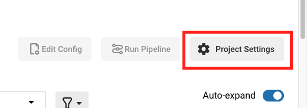

# Dynamic Config Example

In this example, we will create a basic dynamic configuration in CircleCI that merges 3 different config files into one config file. 

## Prereqs

- Some basic knowledge of YAML and CircleCI configuration

## What is Dynamic Config? 

The ability to generate configurations dynamically depending on specific pipeline parameters. Dynamic config allows you to:

- Execute conditional workflows/commands
- Pass pipeline parameter values and/or generate additional configuration
- Trigger separate config.yml configurations which exist outside the default parent .circleci/ directory

## Getting Started with Dynamic Config

A few setup steps are required to begin using dynamic config. The first is enableing dynamic config on your desired project in CircleCI. 

- In CircleCI, open the project settings that you would like to enable dynamic config on. 

